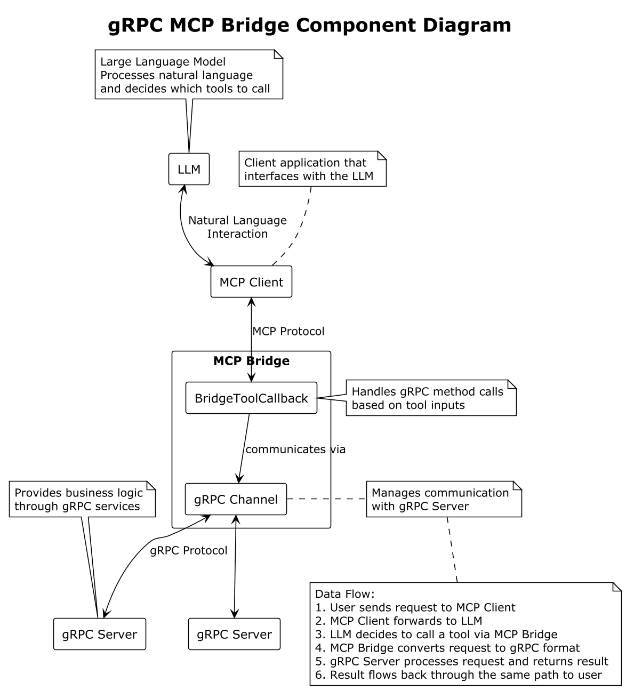

# gRPC MCP Bridge

gRPC MCP Bridge is a tool for converting gRPC services to MCP (Model-Client Protocol) services, enabling large language models to call gRPC services through the MCP protocol. This project also supports Spring Boot auto-configuration, allowing users to quickly integrate MCP services using annotations.

## Project Overview

In large language model application development, we often need to allow models to call external tools or services to extend their capabilities. The MCP protocol is a tool invocation protocol specifically designed for large language models, while gRPC is an efficient remote procedure call framework. This project aims to build a bridge between gRPC and MCP, making it easy for developers to expose existing gRPC services as MCP tools that can be called by large language models.

## Main Components

The project consists of the following main components:

1. **grpc-llm-bridge-core**: Core module providing gRPC to MCP conversion functionality
   - GrpcBridgeToolDefinition: Defines metadata for gRPC methods as MCP tools
   - GrpcBridgeToolCallback: Handles gRPC method calls based on tool inputs
   - GrpcBridgeToolResultConverter: Converts protobuf message objects to formatted strings

2. **mcp-bridge-grpc-springboot-starter**: Spring Boot auto-configuration module providing annotation support
   - BridgeToolCallbackAutoConfigure: Automatically detects and registers BridgeToolCallback instances
   - Provides adapter classes bridging MCP and Spring AI components

3. **Example Applications**:
   - example-grpc-service: Example gRPC service
   - example-grpc-bridge-mcp-server: Example MCP Bridge application
   - example-client-springboot: Example MCP client application

## Usage Instructions

### Using Spring Boot Auto-Configuration

1. Add the dependency:

```xml
<dependency>
    <groupId>io.masterkun.ai</groupId>
    <artifactId>mcp-bridge-grpc-springboot-starter</artifactId>
    <version>${version}</version>
</dependency>
```

2. Create a gRPC channel:

```java
@Bean
public ManagedChannel grpcChannel() {
    return ManagedChannelBuilder.forAddress("localhost", 8080)
            .usePlaintext()
            .build();
}
```

3. Register gRPC methods as MCP tools:

```java
@Bean
public BridgeToolCallback<?> myGrpcMethod(ManagedChannel channel) {
    return new GrpcBridgeToolCallback<>(MyServiceGrpc.getMyMethodMethod(), channel);
}
```

### Without Using Spring Boot

1. Add the dependency:

```xml
<dependency>
    <groupId>io.masterkun.ai</groupId>
    <artifactId>mcp-bridge-grpc-core</artifactId>
    <version>${version}</version>
</dependency>
```

2. Manually create and register tools:

```java
ManagedChannel channel = ManagedChannelBuilder.forAddress("localhost", 8080)
        .usePlaintext()
        .build();

BridgeToolCallback<?> callback = new GrpcBridgeToolCallback<>(
        MyServiceGrpc.getMyMethodMethod(), channel);

// Register to your MCP service
```

## Example Scenarios

The project includes a complete example demonstrating how to convert a gRPC service to an MCP service through the MCP Bridge, and how to call the service using a client:

1. **example-grpc-service**: A simple gRPC service providing two methods
   - `toUpperCase`: Converts a string to uppercase
   - `getTime`: Gets the current time in a specified timezone

2. **example-grpc-bridge-mcp-server**: A Spring Boot application that converts the gRPC service to an MCP service

3. **example-client-springboot**: A Spring Boot application that calls the MCP service through a large language model

For detailed example usage instructions, please refer to [example/README.md](example/README.md).

## How It Works

1. The client receives a natural language request from the user
2. The large language model understands the request and decides to call the appropriate tool
3. The large language model calls the tool provided by the Bridge through the MCP protocol
4. The Bridge converts the MCP request to a gRPC request and calls the gRPC service
5. The gRPC service processes the request and returns the result
6. The Bridge converts the gRPC response to an MCP response and returns it to the large language model
7. The large language model integrates the result into a natural language response and returns it to the user

### Component Diagram

The following diagram illustrates the component structure and interactions of the gRPC MCP Bridge:



## Installation and Setup

1. Clone the repository:

```bash
git clone https://github.com/yourusername/mcp-bridge-grpc.git
cd mcp-bridge-grpc
```

2. Build the project:

```bash
mvn clean install
```

3. Add the dependencies to your project (see "Usage Instructions" section)

## License

[Apache License 2.0](LICENSE)
